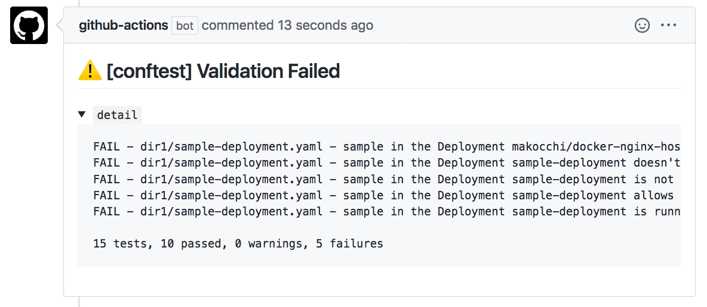

# Validate Kubernetes manifests by conftest

[](https://github.com/makocchi-git/actions-k8s-manifests-validate/actions)

Validate [Kubernetes](https://github.com/kubernetes/kubernetes) manifests in your repository.  
This action uses [conftest](https://github.com/open-policy-agent/conftest) for validating.



## Usage

### Basic

```yaml
# .github/workflows/manifests-validation.yml
name: Pull Request Check

on: [pull_request]

jobs:
  validation:
    runs-on: ubuntu-latest
    steps:
      - uses: actions/checkout@v2
      - name: validate manifests in dir1 and dir2
        uses: makocchi-git/actions-k8s-manifests-validate-conftest@1.0.0
        with:
          file: manifest-dir
          token: ${{ secrets.GITHUB_TOKEN }}
```

### Input parameters

| Parameter  | Description                                                                     | Default   |
| ---------- | ------------------------------------------------------------------------------- | --------- |
| `file`     | File or directory to validate                                                   | `.`       |
| `output`   | Output format for conftest results - valid options are: [stdout json tap table] | `stdout`  |
| `policy`   | Path to the Rego policy files directory                                         | `/policy` |
| `trace`    | Enable more verbose trace output for rego queries                               | `false`   |
| `comment`  | Write validation details to pull request comments                               | `true`    |
| `token`    | Github token for api. This is required if `comment` is true                     | `""`      |

